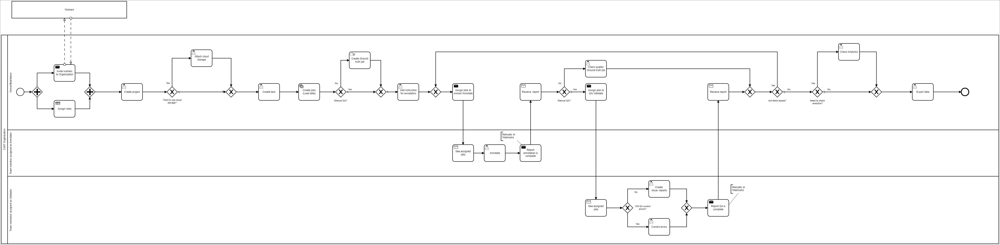

# CVATとDatumaroの紹介

CVATを使ってデータのアノテーションをより速く、より良く行うためのコースシリーズ第1弾ビデオをご紹介します。
この4分間のイントロダクションビデオでは、以下について説明します。

1. CVATとDatumaroがどのような課題を解決するのか
2. これらがどのようにモデルの学習プロセスを加速できるのか
3. さらに詳しく使い方を学ぶためのリソース

# CVAT概要

機械学習システムは低品質なデータのためにしばしば苦戦します。効果的なツールがなければ、モデルの改善は困難で非効率的になります。

[**CVAT.ai**](https://www.cvat.ai/) は、**多用途な画像および動画のアノテーションツール**であり、世界中のコンピュータビジョンコミュニティに提供されています。

私たちの目標は、データ中心AIアプローチを用いて、開発者、企業、組織を世界規模で支援することです。

CVATは3つのバージョンを提供しています：

- [**CVAT Cloud**](https://app.cvat.ai/): CVATをオンラインですぐに開始でき、**無料で利用可能**です。[**サブスクリプション**](https://www.cvat.ai/pricing/cloud)を選択すると、**無制限のデータ**、**コラボレーション**、**自動アノテーション**や[**その他**](https://www.cvat.ai/post/cvat-ai-pricing-plans-choosing-the-right-plan-for-your-needs)の機能も利用できます。
- **セルフホスト型CVAT コミュニティエディション**：セットアップには**セルフホストインストールガイド**をご覧ください。
- **セルフホスト型CVAT エンタープライズエディション**：本バージョンでは[**エンタープライズ向けサポート**](https://www.cvat.ai/pricing/on-prem)を提供しており、**SSO**、**LDAP**、[**RoboflowやHuggingFace**](https://www.cvat.ai/post/integrating-hugging-face-and-roboflow-models)との高度な連携、**高度な分析機能**など**プレミアム機能**を含みます。**専門トレーニング**や**24時間SLAサポート**もご用意しています。

詳細は以下をご覧ください：

- [ツールとフォーマット](#tools-and-formats)
  - [対応フォーマット](#supported-formats)
  - [アノテーションツール](#annotation-tools)
- [自動ラベリング](#automated-labeling)
- [便利なリンク集](#useful-links)
  - [クラウド](#cloud)
  - [セルフホスト](#self-hosted)
- [連携サービス](#integrations)
- [ライセンス情報](#license-information)
- [お問い合わせ](#get-in-touch)

## ツールとフォーマット

CVATは、画像と動画のアノテーションにおける包括的なツールであり、さまざまなコンピュータビジョンタスクに不可欠です。
使いやすさ、柔軟性、幅広いフォーマットやツールとの互換性に重点を置いています。

### 対応フォーマット

CVATは以下のフォーマットに対応しています：

- **3D用**: `.pcd`, `.bin`
- **画像用**: Pythonの[**Pillowライブラリ**](https://pillow.readthedocs.io/en/stable/handbook/image-file-formats.html)でサポートされているすべてのフォーマット（`JPEG`、`PNG`、`BMP`、`GIF`、`PPM`、`TIFF`など）
- **動画用**: ffmpegでサポートされているすべてのフォーマット（`MP4`、`AVI`、`MOV`など）

アノテーションのエクスポート・インポートフォーマットについては**CVATからのアノテーション・データのエクスポート**を参照してください。

### アノテーションツール

CVATは、画像や動画ラベリングの様々な側面に対応する豊富なアノテーションツールを提供しています。

| アノテーションツール | 用途事例 |
| --- | --- |
| **3Dオブジェクトアノテーション** | 自動運転車の学習など、奥行き認識や体積推定が必要なプロジェクトに最適 |
| **属性アノテーションモード** | 色、大きさ、その他の特徴など、物体に詳細な情報を付与したい場合に便利 |
| **矩形アノテーション** | 建物の窓検出など、箱型のシンプルな物体検出に最適 |
| **ポリゴンアノテーション** | 地図の地形や製品の複雑な形状の輪郭など、複雑な形状への対応に適しています |
| **ポリラインアノテーション** | 道路や小道、ポーズ推定の四肢など、線状オブジェクトのアノテーションに最適 |
| **楕円アノテーション** | 皿、ボール、目玉など、円形や楕円形でのアノテーションが必要な場合に最適 |
| **立方体アノテーション** | 2D画像内の3Dオブジェクト（部屋のレイアウト内の箱や家具など）に便利 |
| **スケルトンアノテーション** | 人体姿勢推定、アニメーション、スポーツや医療分野での動作解析に最適 |
| **ブラシツールアノテーション** | 医療画像など、精密なアノテーションが必要な細かい作業に最適 |
| **タグアノテーション** | データセット内のシーンやテーマ識別など、画像・動画の分類作業に便利 |

これらのツールにより、CVATは基本的なラベリングから高度で多次元なタスクまで、幅広いアノテーションニーズに対応可能なプラットフォームとなっています。

## 自動ラベリング

CVATは自動ラベリング機能を搭載しており、アノテーション作業を大幅に効率化し、最大10倍まで高速化することが可能です。

> **注記:**
> 詳細については**OpenCVとAIツール**をご参照ください。

対応アルゴリズムと稼働プラットフォームの詳細は下表をご覧ください：

| アルゴリズム名 | カテゴリ | フレームワーク | CPU対応 | GPU対応 |
| --- | --- | --- | --- | --- |
| [Segment Anything](https://github.com/cvat-ai/cvat/tree/develop/serverless/pytorch/facebookresearch/sam/nuclio) | インタラクタ | PyTorch | ✔️ | ✔️ |
| [Deep Extreme Cut](https://github.com/cvat-ai/cvat/tree/develop/serverless/openvino/dextr/nuclio) | インタラクタ | OpenVINO | ✔️ |  |
| [Faster RCNN](https://github.com/cvat-ai/cvat/tree/develop/serverless/openvino/omz/public/faster_rcnn_inception_resnet_v2_atrous_coco/nuclio) | 検出器 | OpenVINO | ✔️ |  |
| [Mask RCNN](https://github.com/cvat-ai/cvat/tree/develop/serverless/openvino/omz/public/mask_rcnn_inception_resnet_v2_atrous_coco/nuclio) | 検出器 | OpenVINO | ✔️ |  |
| [YOLO v3](https://github.com/cvat-ai/cvat/tree/develop/serverless/openvino/omz/public/yolo-v3-tf/nuclio) | 検出器 | OpenVINO | ✔️ |  |
| [YOLO v7](https://github.com/cvat-ai/cvat/tree/develop/serverless/onnx/WongKinYiu/yolov7/nuclio) | 検出器 | ONNX | ✔️ | ✔️ |
| [Object Reidentification](https://github.com/cvat-ai/cvat/tree/develop/serverless/openvino/omz/intel/person-reidentification-retail-0277/nuclio) | ReID | OpenVINO | ✔️ |  |
| [Semantic Segmentation for ADAS](https://github.com/cvat-ai/cvat/tree/develop/serverless/openvino/omz/intel/semantic-segmentation-adas-0001/nuclio) | 検出器 | OpenVINO | ✔️ |  |
| [Text Detection v4](https://github.com/cvat-ai/cvat/tree/develop/serverless/openvino/omz/intel/text-detection-0004/nuclio) | 検出器 | OpenVINO | ✔️ |  |
| [SiamMask](https://github.com/cvat-ai/cvat/tree/develop/serverless/pytorch/foolwood/siammask/nuclio) | トラッカー | PyTorch | ✔️ | ✔️ |
| [TransT](https://github.com/cvat-ai/cvat/tree/develop/serverless/pytorch/dschoerk/transt/nuclio) | トラッカー | PyTorch | ✔️ | ✔️ |
| [f-BRS](https://github.com/cvat-ai/cvat/tree/develop/serverless/pytorch/saic-vul/fbrs/nuclio) | インタラクタ | PyTorch | ✔️ |  |
| [HRNet](https://github.com/cvat-ai/cvat/tree/develop/serverless/pytorch/saic-vul/hrnet/nuclio) | インタラクタ | PyTorch |  | ✔️ |
| [Inside-Outside Guidance](https://github.com/cvat-ai/cvat/tree/develop/serverless/pytorch/shiyinzhang/iog/nuclio) | インタラクタ | PyTorch | ✔️ |  |
| [Faster RCNN](https://github.com/cvat-ai/cvat/tree/develop/serverless/tensorflow/faster_rcnn_inception_v2_coco/nuclio) | 検出器 | TensorFlow | ✔️ | ✔️ |
| [RetinaNet](https://github.com/cvat-ai/cvat/tree/develop/serverless/pytorch/facebookresearch/detectron2/retinanet_r101/nuclio) | 検出器 | PyTorch | ✔️ | ✔️ |
| [Face Detection](https://github.com/cvat-ai/cvat/tree/develop/serverless/openvino/omz/intel/face-detection-0205/nuclio) | 検出器 | OpenVINO | ✔️ |  |

## 便利なリンク集

CVAT利用の出発点としてご活用ください。

### クラウド

| 名称 | 説明 |
| --- | --- |
| **ユーザーマニュアル** | CVATのすべてのツールを網羅した総合ガイド。各ツールの説明、品質管理手法、データのインポート・エクスポート手順等を掲載。CVAT Cloud・セルフホスト両方のバージョンで有用です。 |
| **組織向けCVAT全体ワークフローガイド** | 組織でCVATを活用したコラボレーション方法を総合的に解説したガイドです。 |
| **サブスクリプション管理** | [**プランの選び方**](https://www.cvat.ai/post/cvat-ai-pricing-plans-choosing-the-right-plan-for-your-needs)、加入、管理方法を学べます。 |
| **XMLアノテーションフォーマット** | CVATで用いられるXMLフォーマットの詳細なドキュメント。データ構造や互換性の理解に必須です。 |

### セルフホスト

| 名称 | 説明 |
| --- | --- |
| **セルフホストインストールガイド** | セルフホスト型ソリューションを導入する際の最初のステップです。 |
| [**データセット管理フレームワーク**](https://github.com/cvat-ai/datumaro/blob/develop/README.md) | セルフホスト版専用のフレームワークおよびCLIツール。データセットの構築・変換・分析に不可欠です。 |
| **サーバーAPI** | CVATサーバはHTTP REST APIを提供し、クライアントアプリケーション（コマンドラインツール・ブラウザ・スクリプト等）とのやり取り方法を解説しています。 |
| **Python SDK** | CVAT SDKは、サーバーとのやり取りやデータ検証・シリアライズ等の追加機能を備えたPythonライブラリです。 |
| **コマンドラインツール** | CVATタスクの管理をシンプルに行えるCLIツール。基本機能を備えており、今後より高度な管理ツールへと発展予定です。 |
| **XMLアノテーションフォーマット** | CVATで用いられるXMLフォーマットの詳細なドキュメント。データ構造や互換性の理解に必須です。 |
| **AWSデプロイガイド** | Amazon Web ServicesへのCVAT導入手順を、必要な工程やコツも含めてステップバイステップで解説しています。 |
| **よくある質問** | CVAT利用に関するよくある質問と回答、役立つ知見を掲載しています。 |

## 連携サービス

CVATは世界中のチームに信頼されているグローバルツールです。
以下は、当社製品のサポートやエコシステムの重要な一員となっている主要企業です。

> **注記:** CVATをご利用中の方は、ぜひ[contact@cvat.ai](mailto:contact+github@cvat.ai)までご一報ください。

| 連携サービス | 対応バージョン | 説明 |
| --- | --- | --- |
| [**Human Protocol**](https://hmt.ai) | クラウド・セルフホスト | CVATを組み込むことで、Human Protocolフレームワーク内のアノテーションサービスを拡張し、データラベリング機能を強化しています。 |
| [**FiftyOne**](https://fiftyone.ai) | クラウド・セルフホスト | オープンソースのデータセット管理・モデル分析ツール。CVATと[密接に連携](https://voxel51.com/docs/fiftyone/integrations/cvat.html)し、アノテーションやラベル精査作業を強化しています。 |
| [**Hugging Face**](https://huggingface.co/) & [**Roboflow**](https://roboflow.com/) | クラウド | CVAT Cloudでは、Hugging FaceやRoboflowのモデルを追加してコンピュータビジョンタスクを強化できます。詳細は[**Hugging Face・Roboflow連携**](https://www.cvat.ai/post/integrating-hugging-face-and-roboflow-models)をご覧ください。 |

## ライセンス情報

CVATには以下のライセンスが含まれます：

| ライセンスタイプ | 適用範囲 | 説明 |
| --- | --- | --- |
| [**MITライセンス**](https://opensource.org/licenses/MIT) | セルフホスト | フリーソフトウェアライセンスで、幅広い利用・改変・再配布が可能です |
| [**LGPLライセンス（FFmpeg）**](https://www.ffmpeg.org) | クラウド・セルフホスト | FFmpegのLGPLライセンスコンポーネントを含みます。追加ライセンスの要否は各自でご確認ください |
| **商用ライセンス** | セルフホストエンタープライズ | エンタープライズ版の商用利用には別途商用ライセンスが必要です |
| [**利用規約**](https://www.cvat.ai/terms-of-use) | クラウド・セルフホスト | プラットフォーム利用時の法的枠組みを規定しています |
| [**プライバシーポリシー**](https://www.cvat.ai/privacy) | クラウド | CVATサービス利用時の情報取り扱いについて説明しています |

## お問い合わせ

以下のチャネルからお問い合わせいただけます：

| サポートチャネル | 対応範囲 | 説明 |
| --- | --- | --- |
| [**Discord**](https://discord.gg/S6sRHhuQ7K) | クラウド・セルフホスト | コミュニティでの質問・議論が可能です |
| [**LinkedIn**](https://www.linkedin.com/company/cvat-ai/) | クラウド・セルフホスト | 最新情報や求人を発信しています |
| [**YouTube**](https://www.youtube.com/@cvat-ai) | クラウド・セルフホスト | チュートリアル動画を公開しています |
| [**GitHub Issues**](https://github.com/cvat-ai/cvat/issues) | クラウド・セルフホスト | バグ報告や開発貢献はこちらから |
| [**サポート窓口**](https://youtrack.cvat.ai/form/447d9c98-ab4b-466e-bf9d-004f01b22f73) | クラウド（有料） | 有料ユーザー専用サポート |
| [**商用サポート**](mailto:contact+github@cvat.ai) | クラウド・セルフホスト | 商用サポートに関するお問い合わせ |

# 組織向けCVAT完全ガイド

CVATを使ったアノテーションプロセスを始めるための総合ガイドです。

このガイドでは、CVATを効果的に活用するために必要な知識とベストプラクティスを提供します。初期セットアップから高度な機能まで、順を追って解説します。

以下の内容をご覧ください：

- [ワークフローの概要](#workflow-diagram)
- [組織向け導入手順](#end-to-end-workflow-for-organizations) 
- [動画チュートリアル](#complete-workflow-guide-video-tutorial)

## ワークフローの概要

以下の図で全体的なプロセスを説明しています：

## 組織向け導入手順

1. アカウント作成
2. 組織の作成
3. チームプランへの加入
4. メンバー招待とロール設定
5. プロジェクト作成
6. クラウドストレージ連携（任意）
7. タスク作成
8. グラウンドトゥルース設定（任意）
9. 作業指示書の追加（任意）
10. Webhook設定（任意）
11. アノテーター割り当て
12. アノテーション作業
13. 精度確認（任意）
14. バリデーター割り当て
15. 検証作業
16. 必要に応じて再割り当て
17. 分析（任意）
18. データエクスポート

## 動画チュートリアル

